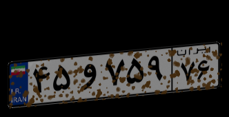

Some Generated Examples:<br/>

<br/>

<br/>


Generated Noisy Examples:<br/>

<br/>

<br/>


<h1>How to use DataMaker2</h1>
<h3>Example</h3>

In order to generate 20000 data using 10 threads for yolo, run this command:

```
python3 DataMaker2.py --size 20000 --workers 10
```

<h2> Caution </h2>

Remeber to create a directory named ``` output ``` at the same directory as ```DataMaker.py```