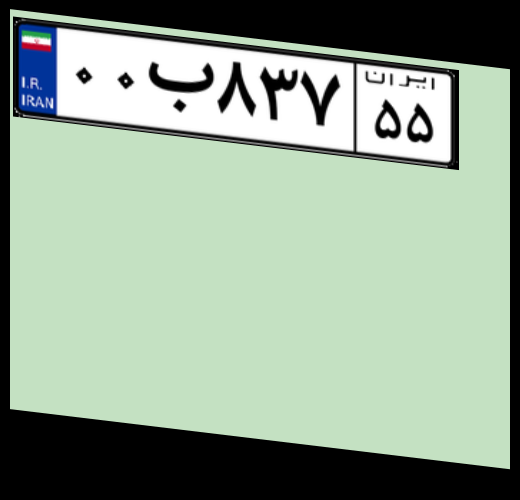
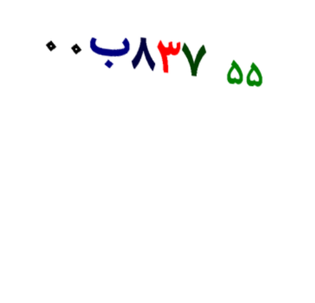
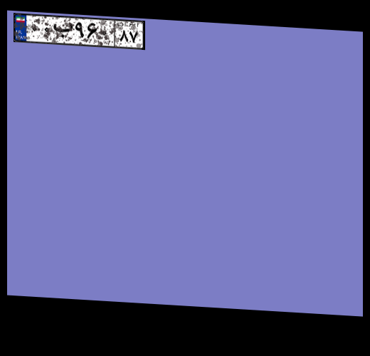
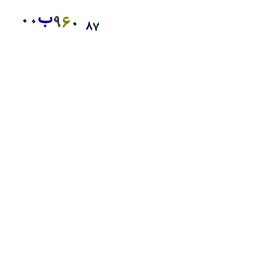
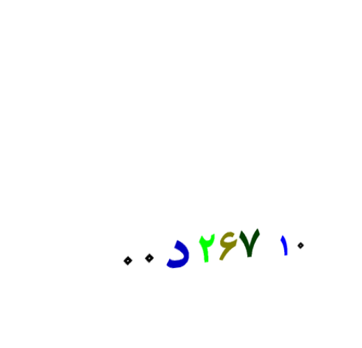
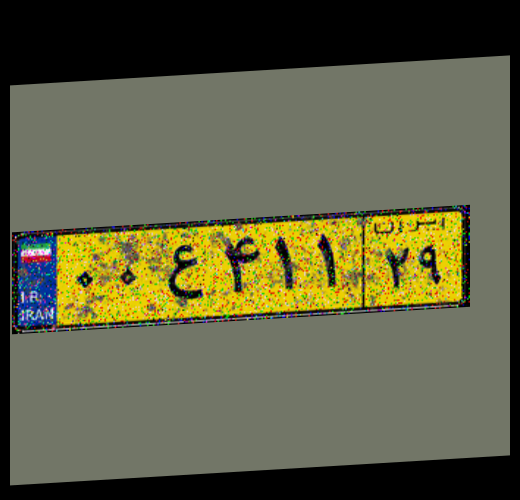
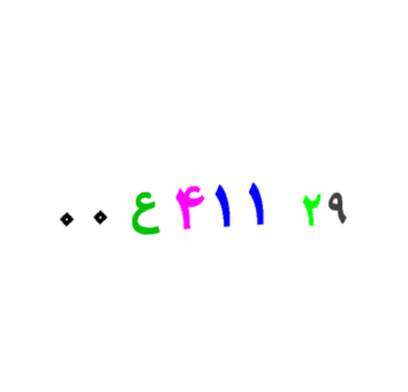
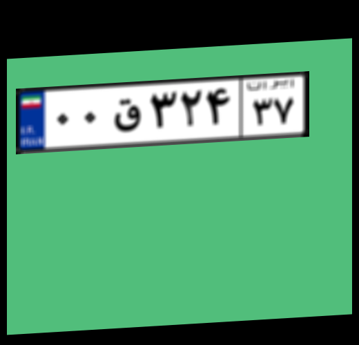
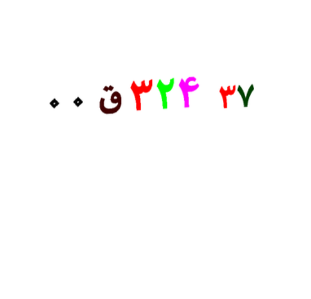

<h3>
HBD BIDEH
2021 Dec 2
</h3>


Generated Examples and Masks:<br/>



<br/>



<br/>



<br/>

<h1>How to use DataMaker for YOLO</h1>
<h3>Example</h3>

In order to generate 20000 data using 10 threads for yolo, run this command:

```
python3 DataMaker.py --size 20000 --workers 10 --img_size 500 400 --save_plate --save_bounding_boxes --mask_state "grayscale" --address "output/yolo/train"

```
Or:

```
python3 DataMaker.py --size 20000 --workers 10 --img_size 500 400 --save_plate --save_bounding_boxes --mask_state "grayscale" --address "output/yolo/test"

```


<h1>How to use DataMaker for UNET, CycleGAN, ...</h1>
<h3>Example</h3>

In order to generate 5000 data using 10 threads for unet, run this command:

```
python3 DataMaker.py --size 5000 --workers 10 --img_size 500 400 --save_plate --save_mask --mask_state "colorful" --address "output/unet/train"
```

Or:

```
python3 DataMaker.py --size 5000 --workers 10 --img_size 500 400 --save_plate --save_mask --mask_state "colorful" --address "output/unet/test"
```

<h1>Glyphs</h1>
<h3>Example</h3>

In order to generate glyphs:

```
python3 DataMaker.py --size 5000 --workers 10 --img_size 500 400 --save_bounding_boxes --save_glyphs --glyph_size 80 80 --mask_state "grayscale" --address "output/yolo/train"
```

<h1>Analytics</h1>
<h3>Example</h3>

In order to count characters:

```
python3 Analytics.py --address output/unet/ --save_path output/
```