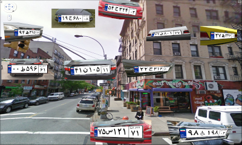

<h1>How to use DataMaker for YOLO</h1>
<h3>Example</h3>
<p>
  
  <br/>
  
  <br/>
</p>

In order to generate 20000 data using 10 threads for yolo, run this command:

```
python3 DataMaker.py --size 20000 --workers 10 --img_size 500 400 --save_plate --save_bounding_boxes --mask_state "grayscale" --crop_to_content --cars files/cars --address "output/yolo/train"

```
Or:

```
python3 DataMaker.py --size 20000 --workers 10 --img_size 500 400 --save_plate --save_bounding_boxes --mask_state "grayscale" --crop_to_content --cars files/cars --address "output/yolo/test"

```


<h1>How to use DataMaker for UNET, CycleGAN, ...</h1>
<h3>Example</h3>
<p>
  
  <br/>
  
  <br/>
</p>
In order to generate 5000 data using 10 threads for unet, run this command:

```
python3 DataMaker.py --size 5000 --workers 10 --img_size 500 400 --save_plate --save_mask --mask_state "colorful" --crop_to_content --cars files/cars --address "output/unet/train"
```

Or:

```
python3 DataMaker.py --size 5000 --workers 10 --img_size 500 400 --save_plate --save_mask --mask_state "colorful" --crop_to_content --cars files/cars --address "output/unet/test"
```

<h1>How to use DataMaker for Extracting glyphs</h1>
<h3>Example</h3>
<p>
  
  
  
  <br/>
</p>

In order to generate glyphs:

```
python3 DataMaker.py --size 5000 --workers 10 --img_size 500 400 --save_bounding_boxes --save_glyphs --glyph_size 80 80 --mask_state "grayscale" --address "output/yolo/train"
```

<h1>How to use StreetMaker for Generate Plate Recognition Dataset</h1>
<h3>Example</h3>
<p>
  
  <br/>
</p>

In order to generate streets:

```
python3 StreetMaker.py --size 10000 --workers 10 --img_size 1000 600 --grid_size 3 3 --backgrounds files/streets --cars files/cars --address "output/unet/train"
```

<h1>How to Augment Datasets</h1>
<h3>Example</h3>

In order to augment streets:

```
python3 DataAugmentor.py --from_directory files/streets --to_directory files/aug/streets --agn_nb_batches 2
```
In order to augment cars:

```
python3 DataAugmentor.py --from_directory files/cars --to_directory files/aug/cars --agn_nb_batches 10

```

<h1>Analytics</h1>
<h3>Example</h3>

In order to count characters:

```
python3 Analytics.py --address output/unet/ --save_path output/
```
